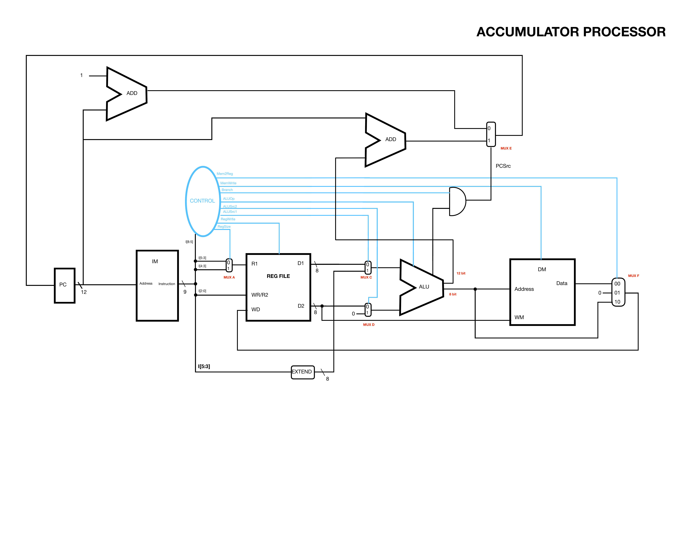
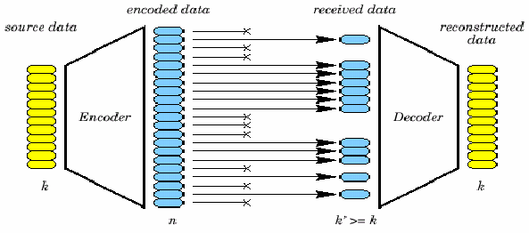

# FEC Instruction Set Architecture with C Assembler

This processor is specifically optimized for Forward Error Correction (FEC) and includes a custom instruction set architecture (ISA) designed for this purpose. FEC is commonly used in radio communications and other systems that operate over lossy links, where retransmitting lost data is expensive, difficult, or impractical.

A particularly interesting example is the Voyager probe, one of humanity’s longest-running computational systems. Voyager passed beyond the heliosphere last year and continues to transmit scientific data back to Earth. A more familiar example is satellite radio: services such as SiriusXM can tolerate several seconds of signal loss—such as when a vehicle passes under a highway overpass—without interrupting the audio stream.

SiriusXM receivers use specialized chips for this purpose, historically including the STA210/240. These chips represent a more advanced implementation of the same general concept: specialized hardware designed to efficiently perform the error-correction computations required for reliable communication over lossy links.

### Machine OP-Code Format - 3 types:

NOTE: CCC or CCCC is the OPCode,
      SS or SSS is the source operand (2nd operand)
      DDD is the destination operand (1st operand)

// M-Type: CCC SSS DDD (For ADDI, SSS is 3 bit immediate w/ range: [-4,3])

000 - MOV
001 - ADDI
010 - STR
011 - LDR

// AL-Type: CCCC SS DDD (SS is source and DDD is destination)

1000 - PAR
1001 - AND
1010 - EOR

// D-Type: CCCC SS DDD (NOTE: DDD will be shifted by 2 to the left for BNE AND BLT)

1100 - CMP
1101 - BNE
1110 - BLT

1011 - ROT
1111 - RST

// ------ Example uses:
// Note no spaces between params and NP = No Parameter
// NP is used to help the parsing in the assembler 
// and are used for instructions that only need one register

MOV X0,X1       // X0 = X1
ADDI X0,imm       // X0 = X0 + imm (possible range for imm [-4,3])
STR X0,X2       // Store X0 at address held by X2
LDR X0,X2       // Retrieve from address in X2 and store data in X0

PAR X0,NP       // X0 = ^X0 (reduction XOR)
AND X0,X1       // X0 = X0 && X1
EOR X0,X1       // X0 = X0 ^ X1 (bitwise XOR)

CMP X0,X1       // X0 - X1 => set flags accordingly
BNE X0,X1       // offset = (X0 << 2) + X1 (branch on not equal)
BLT X0,X1       // Same as above (but branch on less than)

ROT X0,NP       // barrel shift data in X0 to the right by 1 bit
RST X0,NP       // X0 = 0 (reset register to 0)

### Control Unit Codes

            RegSize  RegWrite  ALUSrc1  ALUSrc2 ALUOp[3]  Branch  MemWrite  Mem2Reg[2]
000 - MOV   0        1         0        1       110       0       0         10
001 - ADDI  X        1         1        0       000       0       0         10
010 - STR   0        0         0        1       110       0       1         XX
011 - LDR   0        1         0        1       110       0       0         00

1000 - PAR  1        1         ?        0       101       0       0         10
1001 - AND  1        1         0        0       010       0       0         10
1010 - EOR  1        1         0        0       011       0       0         10

1100 - CMP  0        0         0        0       001       0       0         XX
1101 - BNE  1        0         0        0       111       1       0         XX
1110 - BLT  1        0         0        0       111       1       0         XX

1111 - RST  X        1         X        X       XXX       0       0         01
1011 - ROT  X        1         X        0       100       0       0         10

### ALU Codes

000 - ADD
001 - SUB - CMP
010 - AND
011 - EOR
100 - ROT
101 - PAR
110 - Pass through
111 - Add offsets for branching (12 bit output)

### Registers

NOTE: Register usage is a suggestion, technically not a rule

R0 - general purpose
R1 - general purpose
R2 - general purpose
R3 - general purpose

R4 - Decoded Register mem[0:29]
R5 - Encoded Register mem[30:59]
R6 - Points to somewhere in memory
R7 - Points to somewhere in memory

### What's in data memory?

mem[0:29] - decoded msg
mem[30:59] - encoded msg

mem[60] - shifted offset for outer loop     - program 1
mem[61] - regular offset for outer loop     - program 1
mem[62] - offset for p4 in syndrome loop    - program 2
mem[63] - offset for p2 in syndrome loop    - program 2
mem[64] - offset for p1 in syndrome loop    - program 2
mem[65] - counter for syndrome loop         - program 2

mem[66] - shifted offset for outer loop     - program 2
mem[67] - regular offset for outer loop     - program 2

mem[70:74] - parity bits recieved (p8,p4,p2,p1,p0 respectively) - program 2
mem[75] - syndrome                          - program 2

mem[76] - condition for p4 for syndrome loop - program 2
mem[77] - condition for p2 for syndrome loop - program 2
mem[78] - condition for p1 for syndrome loop - program 2

mem[82] - outer loop counter for both program 1 and program 2
mem[83] - decoded address pointer (e.g. &mem[0])    - program 2
mem[84] - encoded address pointer (e.g. &mem[30])   - program 2

### Using the assembler (steps to get from assembly to machine code)

1) Write your assembly code, if writing a comment do so in its own line with no spaces in front.

Consider the following example box with an ADDI instruction, blank lines between instructions is fine as this will be passed through a filter.

        |---------------------|
        |                     |
        |// This is a comment |
        |                     |
        |ADDI X1,X0           |
        |                     |
        |---------------------|

The following is NOT OK:

        |---------------------|
        |                     |
        | // This is a comment|
        |                     |
        |ADDI X1,X0           |
        |                     |
        |---------------------|

Notice the space in front of the comment.
The following is also NOT OK:

        |---------------------|
        |                     |
        | // This is a comment|
        |                     |
        |ADDI X1,X0 // comment|
        |                     |
        |---------------------|

Comments and instructions need to be separated.

NOTE: Some instructions have a capacity for the source operand as "SS" i.e. only 3 lower registers allowed:

X0,X1,X2 and X3.

2) Save your file, put file in assembler directory.

Do the following command:

$ bash filter.sh filename.txt

Next go inside main.c and change the variable "filenameREAD" to your assembly code file, in this case filename.txt

Now do the following commands:

$ bash clean.sh
$ bash compile.sh
$ ./main

If no errors, then machine code file "machinecode.txt" has been successfully created.

A debug file "machinecodeDB.txt" has also been created which has the machine code on the left and the asssembly code on the right.

Simply copy this machine code and put it inside of "mach\_code.txt" where SystemVerilog modules are located.

